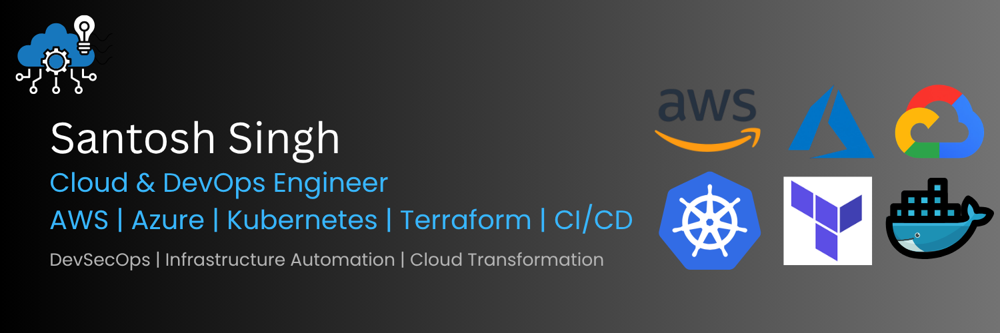

# Hi, I'm Santosh Singh 👋

## Cloud & DevOps Engineer | Cloud Governance | DevSecOps

Experienced Cloud & DevOps professional with 14+ years of experience in Cloud Transformation, DevOps Governance, Infrastructure Automation, CI/CD, Quality Engineering, and Delivery Assurance.

---

# 🚀 Certifications

- Microsoft Certified: Azure Administrator
- Google Certified Professional Cloud Architect
- Google Certified Associate Cloud Engineer
- Executive PG Certification – Cloud Computing & DevOps (IIT Roorkee)
- ITIL v3 Foundation
- Lean Six Sigma Black Belt

---

# ☁️ Cloud Platforms

- AWS
- Microsoft Azure
- Google Cloud Platform (GCP)

---

# ⚙️ DevOps & Automation

- Jenkins
- Azure DevOps
- GitHub Actions
- Docker
- Kubernetes / AKS
- Terraform
- Ansible
- Helm
- CI/CD Pipelines

---

# 🛠️ Scripting & Tools

- Linux
- Bash/Shell Scripting
- Git & GitHub
- YAML
- Power BI
- Minitab

---

# 📌 Featured Projects

## 🔹 AWS Multi-Tier Infrastructure
- Secure AWS architecture using EC2, RDS, VPC, Route 53, IAM
- Infrastructure automation with Terraform
- CloudWatch monitoring implementation

## 🔹 Azure Secure Landing Zone
- Hub-Spoke architecture
- Azure Policies & Defender for Cloud
- Infrastructure-as-Code using Terraform

## 🔹 AKS DevOps Automation
- CI/CD pipelines with Azure DevOps & Jenkins
- Kubernetes deployments on AKS
- Docker containerization and deployment automation

## 🔹 Enterprise CI/CD Automation
- Jenkins pipelines
- GitHub webhooks
- Docker image automation
- Terraform & Ansible integration

---

# 📊 GitHub Stats

---

# 🌐 Connect With Me

- LinkedIn: https://linkedin.com/in/santosh-singh-141a5775
- GitHub: https://github.com/santoshsingh7891

---

# 🎯 Areas of Interest

- Cloud Architecture
- DevOps Engineering
- Kubernetes Automation
- Infrastructure as Code
- DevSecOps
- Cloud Governance
- CI/CD Automation
